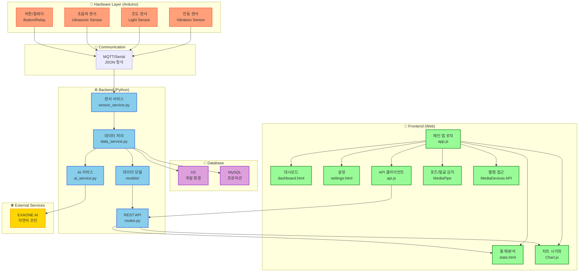
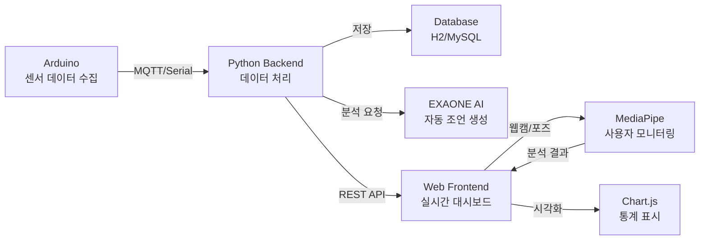
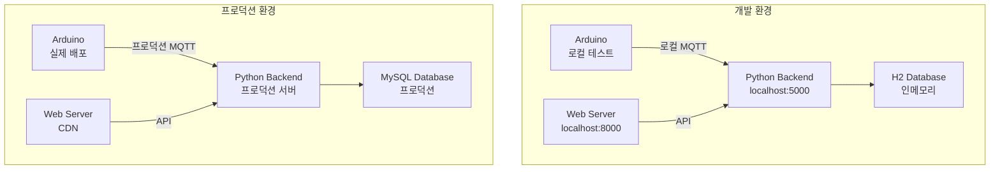

# 집중력 강화 시스템 - 시스템 아키텍처

## 전체 시스템 다이어그램

## 데이터 흐름

## 컴포넌트 상세

### Hardware (Arduino)
- **진동 센서**: 타이핑/사용 감지, 외부 소음, 패턴 분석
- **조도 센서**: 실내 조명 감지, 수면 패턴 추적
- **초음파 센서**: 앉은 자세 감지, 거리 모니터링
- **버튼/릴레이**: 조명 제어, 수동 조작
- **통신**: MQTT 또는 Serial 프로토콜로 JSON 형식 전송

### Backend (Python)
- **api/** - REST API 엔드포인트 정의 및 요청 처리
- **services/** - 비즈니스 로직
  - `sensor_service.py` - 센서 데이터 수집/처리
  - `data_service.py` - 데이터 분석 및 통계
  - `ai_service.py` - EXAONE AI 통합
- **models/** - 데이터 모델 (Sensor, User, Statistics)
- **config/** - 환경 설정

### Frontend (Web)
- **페이지**
  - Dashboard: 실시간 센서 데이터 모니터링
  - Stats: 집중 시간, 환경 통계 분석
  - Settings: 사용자 설정
- **기능**
  - Chart.js: 실시간 차트 시각화
  - MediaPipe: 포즈/얼굴 감지로 사용자 상태 모니터링
  - MediaDevices API: 웹캠 접근
  - Fetch API: 백엔드 통신

### Database
- **개발 환경**: H2 (인메모리, 자동 생성)
- **프로덕션**: MySQL
- **테이블**
  - `sensors` - 센서 데이터
  - `users` - 사용자 정보
  - `statistics` - 통계 데이터

## 기술 스택

| 계층 | 기술 |
|------|------|
| **Hardware** | Arduino, 다양한 센서 |
| **Backend** | Python, REST API |
| **Frontend** | HTML, CSS, Vanilla JavaScript |
| **AI** | EXAONE (LLM) |
| **Database** | H2 (dev), MySQL (prod) |
| **Libraries** | Chart.js, MediaPipe |

## 배포 아키텍처

